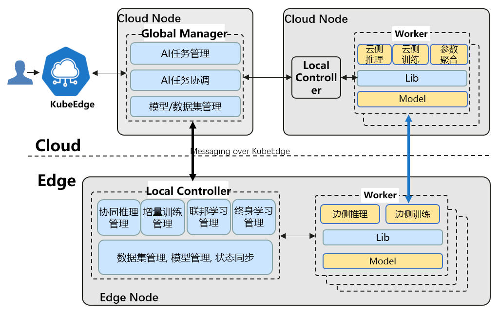
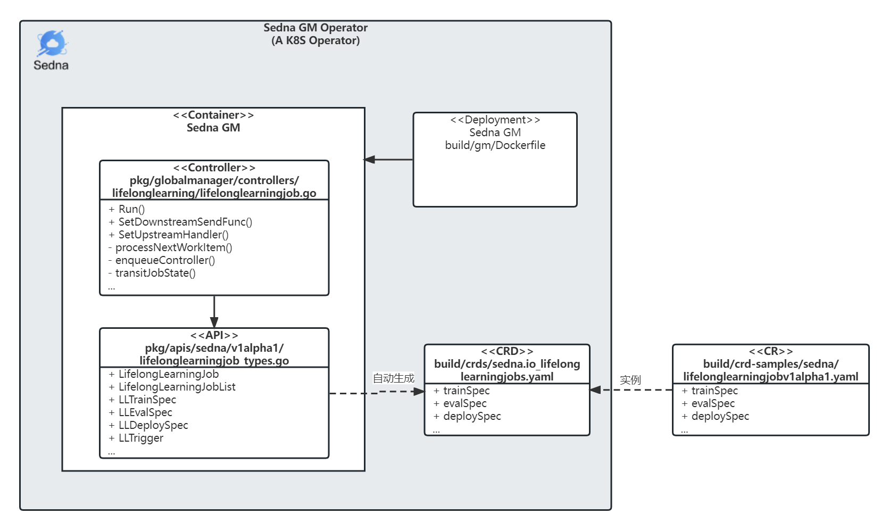
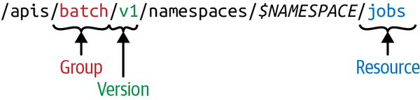
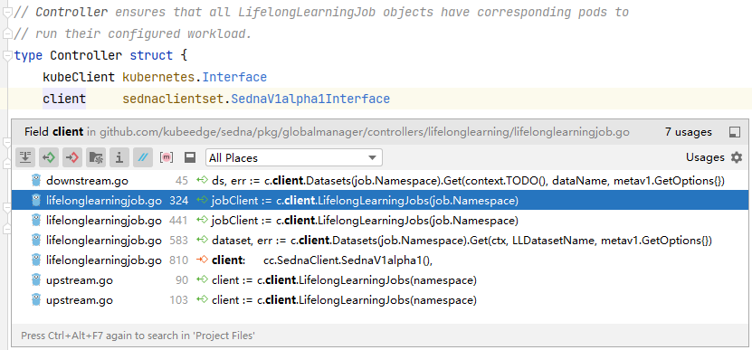
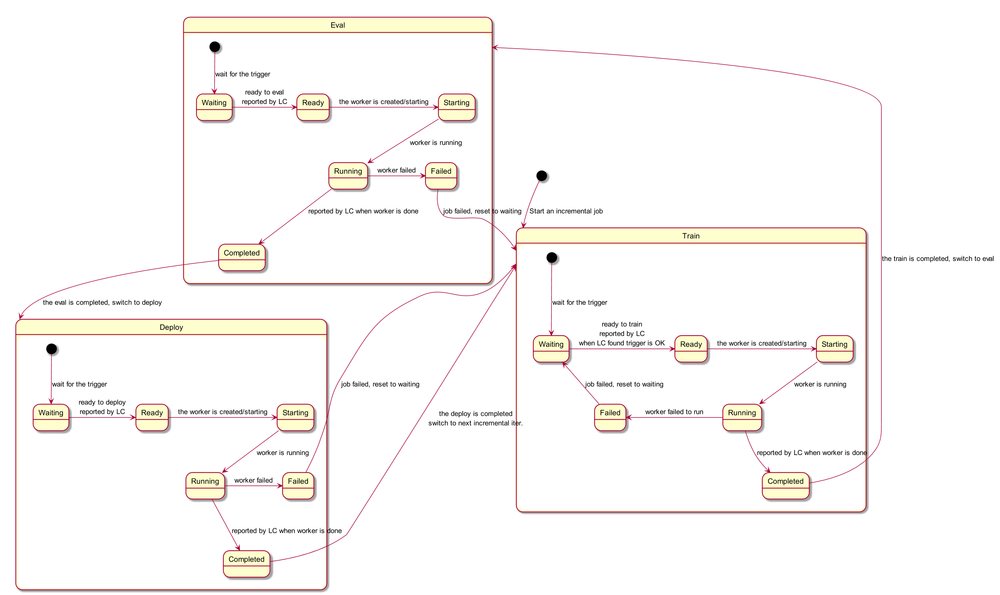

# KubeEdge-Sedna概述

Sedna是在KubeEdge SIG AI中孵化的一个边云协同AI项目。得益于KubeEdge提供的边云协同能力，Sedna可以实现跨边云的协同训练和协同推理能力，如联合推理、增量学习、联邦学习、终身学习等。Sedna支持目前广泛使用的AI框架，如TensorFlow/Pytorch/MindSpore等，现有AI类应用可以无缝迁移到Sedna, 快速实现边云协同的训练和推理，可在降低成本、提升模型性能、保护数据隐私等方面获得提升。

项目主页：
https://github.com/kubeedge/sedna

文档参考：
https://sedna.readthedocs.io

## 整体架构

Sedna的边云协同基于KubeEdge提供的如下能力实现
* 跨边云应用统一编排
* Router: 管理面云边高可靠消息通道
* EdgeMesh: 数据面跨边云微服务发现和流量治理



**基本组件**：


* **GlobalManager**
  * 统一边云协同AI任务管理
  * 跨边云协同管理与协同
  * 中心配置管理


* **LocalController**

  * 边云协同AI任务的本地流程控制

  * 本地通用管理: 模型，数据集，状态同步等


* **Lib**

  * 面向AI开发者和应用开发者，暴露边云协同AI功能给应用

* **Worker**

  * 执行训练或推理任务, 基于现有AI框架开发的训练/推理程序

  * 不同特性对应不同的worker组，worker可部署在边上或云上，并进行协同

## 工程目录

| 目录       | 说明                                                         |
| ---------- | ------------------------------------------------------------ |
| .github    | Sedna github CICD流水线配置。                                |
| LICENSES   | Sedna Licenses以及相关vendor Licenses。                      |
| build      | GM/LC等管理面构建的Dockersfile；<br />生成的CRD定义yaml文件；<br />CRD样例yaml文件; |
| cmd        | GM/LC管里面的启动函数。                                      |
| components | 监控和图形化展示的组件。                                     |
| docs       | proposals和安装文档。                                        |
| examples   | 协同推理、增量学习、终身学习、联邦学习的使用样例。           |
| hack       | 面向开发者的代码生成工具、及其他开发会用到的脚本。           |
| lib        | Sedna Library，用于开发边云协同AI应用的Python依赖库。        |
| pkg        | API定义；<br />生成的CRD的client-go代码；<br />Sedna GM/LC 管里面的核心代码。 |
| scripts    | 面向使用者的安装脚本。                                       |
| test       | E2E测试代码及测试工具。                                      |
| vendor     | 依赖的第三方项目源码。                                       |


# Sedna管理面源码解析（Go）

## GM: Global Manager
### GM，一个K8S operator

**operator是什么？**

> An Operator is an application-specific controller that extends the Kubernetes API to create, configure and manage instances of complex stateful applications on behalf of a Kubernetes user.  It builds upon the basic Kubernetes resource and controller concepts, but also includes domain or application-specific knowledge to automate common tasks better managed by computers.  [^1]


对于Sedna，Sedna控制了边云协同AI应用中，如何配置worker部署启动参数、如何协同、如何流转等，那么我们可以这么定义：**Sedna GM是“边云协同AI应用“这个特定领域的控制器**。


> *The following components form the three main parts of an operator:*
>
> - *API*: The data that describes the operand’s configuration. The API includes:
>   - ***Custom resource definition (CRD)***, which defines a schema of settings available for configuring the operand.
>   - ***Programmatic API***, which defines the same data schema as the CRD and is implemented using the operator’s programming language, such as [*Go*](https://developers.redhat.com/blog/category/go/)*.*
>   - ***Custom resource (CR)***, which specifies values for the settings defined by the CRD; these values describe the configuration of an operand.
> - ***Controller***: The brains of the operator. The controller creates managed resources based on the description in the custom resource; controllers are implemented using the operator’s programming language, such as Go. [^2]

通过上面Redhat的定义，我们可以看到组成一个k8s operator几个重要的概念包括 CRD、API、CR和Controller。

下面是Sedna GM Operator的示意图：




接下来的章节会按照组成K8S operator的几个组件来展开说明，包括CR、CRD、API、Controller，其中Controller是主要的控制逻辑模块。

### CR

Sedna本身支持边云协同推理、增量学习、终身学习、联邦学习，为了方便解读代码，本文结合终身学习具体特性和样例来分析。其他三个特性的代码实现存在共通之处，可以类比参考。

**CR样例**

这里贴了一段终身学习[CR样例](https://github.com/kubeedge/sedna/blob/main/build/crd-samples/sedna/lifelonglearningjobv1alpha1.yaml)，可以基于这个CR通过kubectl来创建对应的终身学习资源对象，详细使用步骤可以参考[这里](https://github.com/kubeedge/sedna/tree/main/examples/lifelong_learning/atcii)。其中关键的字段解释如下：

- dataset：指定数据集对象名称，数据集也是一个CR资源。

- trainSpec：终身学习中，训练worker的启动参数，包括镜像和环境变量等容器配置。
- trigger：终身学习中，启动训练worker的触发条件。

- evalSpec：终身学习中，评估work的启动参数，包括镜像和环境变量等容器配置。
- deploySpec：终身学习中，推理work的启动参数，包括镜像和环境变量等容器配置。
- outputDir：终身学习中，训练生成的模型文件输出路径。

`build/crd-samples/sedna/lifelonglearningjobv1alpha1.yaml`

```yaml
apiVersion: sedna.io/v1alpha1
kind: LifelongLearningJob
metadata:
  name: atcii-classifier-demo
spec:
  dataset:
    name: "lifelong-dataset"
    trainProb: 0.8
  trainSpec:
    template:
      spec:
        nodeName:  "edge-node"
        containers:
          - image: kubeedge/sedna-example-lifelong-learning-atcii-classifier:v0.3.0
            name:  train-worker
            imagePullPolicy: IfNotPresent
            args: ["train.py"]
            env:
              - name: "early_stopping_rounds"
                value: "100"
              - name: "metric_name"
                value: "mlogloss"
    trigger:
      checkPeriodSeconds: 60
      timer:
        start: 02:00
        end: 24:00
      condition:
        operator: ">"
        threshold: 500
        metric: num_of_samples
  evalSpec:
    template:
      spec:
        nodeName:  "edge-node"
        containers:
          - image: kubeedge/sedna-example-lifelong-learning-atcii-classifier:v0.3.0
            name:  eval-worker
            imagePullPolicy: IfNotPresent
            args: ["eval.py"]
            env:
              - name: "metrics"
                value: "precision_score"
              - name: "metric_param"
                value: "{'average': 'micro'}"
              - name: "model_threshold"
                value: "0.5"
  deploySpec:
    template:
      spec:
        nodeName:  "edge-node"
        containers:
        - image: kubeedge/sedna-example-lifelong-learning-atcii-classifier:v0.3.0
          name:  infer-worker
          imagePullPolicy: IfNotPresent
          args: ["inference.py"]
          env:
          - name: "UT_SAVED_URL"
            value: "/ut_saved_url"
          - name: "infer_dataset_url"
            value: "/data/testData.csv"
          volumeMounts:
          - name: utdir
            mountPath: /ut_saved_url
          - name: inferdata
            mountPath: /data/
          resources:
            limits:
              memory: 2Gi
        volumes:
          - name: utdir
            hostPath:
              path: /lifelong/unseen_task/
              type: DirectoryOrCreate
          - name: inferdata
            hostPath:
              path:  /data/
              type: DirectoryOrCreate
  outputDir: "/output"
```


### CRD 

CRD可以看作是CR的模板，在k8s集群能创建对应CR之前需要将对应的CRD在k8s集群中进行声明。CRD对应的yaml文件可以手动编写或自动生成，对于一些相对复杂的CRD定义建议采用通过k8s相关工具生成。比如Sedna这里使用的是kubebuilder的[controller-gen](https://book.kubebuilder.io/reference/controller-gen.html#controller-gen-cli)进行自动生成与更新，Sedna项目提供了封装好的脚本，直接通过`make crds`命令即可生成和更新对应`build/crds/`目录下的CRD文件。相关shell脚本可以参考这个文件`Makefile`中的`crds: controller-gen`。

想要完成一个CRD定义，最重要的是需要指定group、version和kind，通常简称为GVK。而CR资源对象本身称为Resource，相较于面向对象中的概念，Resouce类比为Object，Kind类比于Class，也就可以说Resource是Kind的实例。下表展示了终身学习CRD和CR对应的GVR和GVK：

|      | Group                | Version  | Resource                      | Kind                     |
| ---- | -------------------- | -------- | ----------------------------- | ------------------------ |
| CRD  | apiextensions.k8s.io | v1       | lifelonglearningjobs.sedna.io | CustomResourceDefinition |
| CR   | sedna.io             | v1alpha1 | lifelonglearningjob           | LifelongLearningJob      |

在K8S集群中资源是以REST URI的形式来组织的，组织的路径如下：



了解了上述的规则后，我们可以快速的拼接好要管理的k8s资源对象的REST URI地址，这为某些不能依赖k8s client（kubectl, client-go等）的情况下访问集群资源提供了简便的方式。比如：

通过Rest接口查看终身学习CRD描述：

```shell
curl -k --cert ./client.crt --key ./client.key https://127.0.0.1:5443/apis/apiextensions.k8s.io/v1beta1/customresourcedefinitions/lifelonglearningjobs.sedna.io
```

通过Rest接口查看终身学习CR列表：

```shell
curl -k --cert ./client.crt --key ./client.key https://127.0.0.1:5443/apis/sedna.io/v1alpha1/lifelonglearningjobs
```

比如如果某些编程语言没有官方的k8s client SDK， 那么可以统一采用如上Rest接口形式进行封装。


下面是Sedna 终身学习CRD定义，一些需要关注的字段如下：

* `apiVersion: apiextensions.k8s.io/v1`，当前所有的CRD都扩展自apiextensions.k8s.io/v1这个Version。

- `kind: CustomResourceDefinition`，当前所有的CRD都继承自CustomResourceDefinition这个Kind。
- `spec.group: sedna.io`，自定义资源的Group名称为sedna.io。
- `spec.names.kind: LifelongLearningJob`, 自定义资源新增加的类型，这里是LifelongLearningJob。
- `spec.names.shortNames: - ll`，在使用kubectl可以使用这个缩写”ll“查询到LifelongLearningJob资源。

`build/crds/sedna.io_lifelonglearningjobs.yaml`

```yaml
apiVersion: apiextensions.k8s.io/v1
kind: CustomResourceDefinition
metadata:
  annotations:
    controller-gen.kubebuilder.io/version: v0.4.1
  creationTimestamp: null
  name: lifelonglearningjobs.sedna.io
spec:
  group: sedna.io
  names:
    kind: LifelongLearningJob
    listKind: LifelongLearningJobList
    plural: lifelonglearningjobs
    shortNames:
    - ll
    singular: lifelonglearningjob
  scope: Namespaced
  versions:
  - name: v1alpha1
	...
status:
  acceptedNames:
    kind: ""
    plural: ""
  conditions: []
  storedVersions: []
```

### API

上面提到我们的CRD是自动生成的，那生成这些CRD所需要的API基础定义在哪里呢？

`pkg/apis/sedna/v1alpha1/lifelonglearningjob_types.go`

```go
package v1alpha1

import (
	v1 "k8s.io/api/core/v1"
	metav1 "k8s.io/apimachinery/pkg/apis/meta/v1"
)

// 这里展示了
// +genclient
// +k8s:deepcopy-gen:interfaces=k8s.io/apimachinery/pkg/runtime.Object
// +kubebuilder:resource:shortName=ll
// +kubebuilder:subresource:status

// 整体的LifelongLearningJob的API定义，主要包含Spec和Status定义，分别代表期望状态和实际状态。
type LifelongLearningJob struct {
	metav1.TypeMeta   `json:",inline"`
	metav1.ObjectMeta `json:"metadata"`
	Spec              LLJobSpec   `json:"spec"`
	Status            LLJobStatus `json:"status,omitempty"`
}

// 在创建LifelongLearningJob时候需要配置的参数；如果需要扩展终身学习字段的接口，可以在这里修改。
type LLJobSpec struct {
	Dataset    LLDataset    `json:"dataset"`
	TrainSpec  LLTrainSpec  `json:"trainSpec"`
	EvalSpec   LLEvalSpec   `json:"evalSpec"`
	DeploySpec LLDeploySpec `json:"deploySpec"`

	// the credential referer for OutputDir
	CredentialName string `json:"credentialName,omitempty"`
	OutputDir      string `json:"outputDir"`
}

type LLDataset struct {
	Name      string  `json:"name"`
	TrainProb float64 `json:"trainProb"`
}

// 剩下还有一些结构体定义省略了。
```

上面的代码片段中，补充了额外的说明，需要注意的有如下几点：

- `// +kubebuilder...` ：注释是给kubebuilder等代码自动生成工具的配置参数，会被这些工具解析。
- `type LifelongLearningJob struct{...}`：定义了终身学习CRD整体API，主要包含Spec和Status定义，分别代表期望状态和实际状态。
- `type LLJobSpec struct {...}`：在创建LifelongLearningJob CR时需要配置的参数；如果需要扩展终身学习字段的接口，可以在这里修改。

其他协同推理、增量学习、联邦学习相关的API定义都可以在`pkg/apis/sedna/v1alpha1/`这个目录下找到。


**更新client-go代码**

一旦新增或者更新了`*_types.go`中的定义，则需要执行如下命令进行client-go代码更新：

```shell
bash hack/update-codegen.sh
```

生成的代码位于`pkg/client`：

```shell
➜  pkg tree client -L 2
client
├── clientset
│   └── versioned
├── informers
│   └── externalversions
└── listers
    └── sedna
```

client-go中的代码会在后面的Contrller逻辑中用到。

**更新CRD定义**

一旦新增或者更新了`*_types.go`中的定义，则需要执行如下命令进行CRD代码更新：

```shell
make crds
```

生成的CRD定义yaml文件位于`build/crds`。更新这些定义之后，也需要同步在K8s集群中重新`kubectl apply`一下，以将新的CRD在集群中生效。

### Controller

终身学习最主要的控制逻辑在这个`pkg/globalmanager/controllers/lifelonglearning/lifelonglearningjob.go`文件里面，包括训练评估Worker什么时候触发、Worker参数如何同步到边缘等。

在进入到终身学习的控制逻辑之前，整体的调用流程可以参考下面伪代码：

```go
cmd/sedna-gm/sedna-gm.go/main() 【1】
pkg/globalmanager/controllers/manager.go/New() 【2】读取GM配置文件。
pkg/globalmanager/controllers/manager.go/Start() 【3】启动GM进程。
    - clientset.NewForConfig()：【4】调用client-go生成了Sedna CRD client。
    - NewUpstreamController()：【5】创建UpstreamController，每个GM进程有一个UpstreamController
    - uc.Run(stopCh)：启动一个for循环协程，来处理
        - pkg/globalmanager/controllers/upstream.go/syncEdgeUpdate() 
    - NewRegistry()：【6】注册所有controller。
        - f.SetDownstreamSendFunc()【7】
            -> pkg/globalmanager/controllers/lifelonglearning/downstream.go
        - f.SetUpstreamHandler()【8】
            -> pkg/globalmanager/controllers/lifelonglearning/upstream.go/updateFromEdge()
        - f.Run()【9】
    - ws.ListenAndServe() 【10】
```

下面为了讲解Sedna LifelongLeraningJob Controller的控制逻辑，也按照上面1~10的标号来讲解：

#### 【1】main函数入口

`sedna-gm.go`是GM模块的启动入口，主要包括日志初始化配置、`app.NewControllerCommand()`中执行了参数的解析、启动GM对应的controller。

`cmd/sedna-gm/sedna-gm.go`

```go
func main() {
   rand.Seed(time.Now().UnixNano())

   command := app.NewControllerCommand()
   logs.InitLogs()
   defer logs.FlushLogs()

   if err := command.Execute(); err != nil {
      os.Exit(1)
   }
}
```

#### 【2】GM系统配置加载

GM加载系统配置，包括K8S集群配置、启动监听的Websocket地址端口、KB服务的地址等。

`pkg/globalmanager/controllers/manager.go`

```go
// New creates the controller manager
func New(cc *config.ControllerConfig) *Manager {
   config.InitConfigure(cc)
   return &Manager{
      Config: cc,
   }
}
```


`pkg/globalmanager/config/config.go`

```go
// ControllerConfig indicates the config of controller
type ControllerConfig struct {
   // KubeAPIConfig indicates the kubernetes cluster info which controller will connected
   KubeConfig string `json:"kubeConfig,omitempty"`

   // Master indicates the address of the Kubernetes API server. Overrides any value in KubeConfig.
   // such as https://127.0.0.1:8443
   // default ""
   Master string `json:"master"`
   // Namespace indicates which namespace the controller listening to.
   // default ""
   Namespace string `json:"namespace,omitempty"`

   // websocket server config
   // Since the current limit of kubeedge(1.5), GM needs to build the websocket channel for communicating between GM and LCs.
   WebSocket WebSocket `json:"websocket,omitempty"`

   // lc config to info the worker
   LC LCConfig `json:"localController,omitempty"`

   // kb config to info the worker
   KB KBConfig `json:"knowledgeBaseServer,omitempty"`

   // period config min resync period
   // default 30s
   MinResyncPeriodSeconds int64 `json:"minResyncPeriodSeconds,omitempty"`
}
```

#### 【3】GM整体初始化

GM整体初始化的步骤如下，包括初始化Sedna CRD client、绑定并启动边云消息通信处理函数、启动各个特定对应的controller、启动websock开始监听消息。

`pkg/globalmanager/controllers/manager.go`

```go
// Start starts the controllers it has managed
func (m *Manager) Start() error {
   ...
   // 初始化Sedna CRD client，Controller会监听Sedna CR 增删改查的变化，并执行对应的处理逻辑。
   sednaClient, err := clientset.NewForConfig(kubecfg)

   ...
   sednaInformerFactory := sednainformers.NewSharedInformerFactoryWithOptions(sednaClient, genResyncPeriod(minResyncPeriod), sednainformers.WithNamespace(namespace))

   // 初始化UpstreamController，用于处理边缘LC上传的消息
   uc, _ := NewUpstreamController(context)
   downstreamSendFunc := messagelayer.NewContextMessageLayer().SendResourceObject
   stopCh := make(chan struct{})
   go uc.Run(stopCh)

   // 针对每个特性（协同推理、终身学习等），绑定对应的消息处理函数
   for name, factory := range NewRegistry() {
      ...
      f.SetDownstreamSendFunc(downstreamSendFunc)
      f.SetUpstreamHandler(uc.Add)
      ...
      // 启动各个特性对应controller
      go f.Run(stopCh)
   }

   ...

   // 启动整体GM的websocket，默认监听在0.0.0.0:9000这个端口地址
   ws := websocket.NewServer(addr)
   ...
}
```

#### 【4】CRD client初始化

`clientset.NewForConfig()`调用的原始函数位于`pkg/client/clientset/versioned/clientset.go`，前面提到这里是由client-go工具根据Sedna CRD定义自动生成的代码，通过go语言调用CRD定义的资源对象的增删改查。

下面代码是LifelongLearningJob Controller初始化的函数，其中就依赖client-go生成的CRD client代码。主要做了这么几件事：

* 获取LifelongLearningJob的Informer。Informer可以看作是controller的K8S api-server的”本地缓存“，用来减少api-server的数据读取压力。

* 配置LifelongLearningJob Controller的参数或成员变量，包括k8s client、sedna client、GM controller通用配置。

* 绑定LifelongLearningJob CRD资源的Add、Update、Delete对应事件的回调函数。

`pkg/globalmanager/controllers/lifelonglearning/lifelonglearningjob.go`

```go
// New creates a new LifelongLearningJob controller that keeps the relevant pods
// in sync with their corresponding LifelongLearningJob objects.
func New(cc *runtime.ControllerContext) (runtime.FeatureControllerI, error) {
   cfg := cc.Config

   podInformer := cc.KubeInformerFactory.Core().V1().Pods()

   // 获取LifelongLearningJob的Informer
   jobInformer := cc.SednaInformerFactory.Sedna().V1alpha1().LifelongLearningJobs()

   eventBroadcaster := record.NewBroadcaster()
   eventBroadcaster.StartRecordingToSink(&v1core.EventSinkImpl{Interface: cc.KubeClient.CoreV1().Events("")})

   // 配置LifelongLearningJob Controller的参数
   jc := &Controller{
      kubeClient: cc.KubeClient,
      client:     cc.SednaClient.SednaV1alpha1(),
      queue:      workqueue.NewNamedRateLimitingQueue(workqueue.NewItemExponentialFailureRateLimiter(runtime.DefaultBackOff, runtime.MaxBackOff), Name),
      cfg:        cfg,
   }

   // 绑定LifelongLearningJob CRD资源的Add、Update、Delete对应事件的回调函数。
   jobInformer.Informer().AddEventHandler(cache.ResourceEventHandlerFuncs{
      AddFunc: func(obj interface{}) {
         jc.enqueueController(obj, true)
         jc.syncToEdge(watch.Added, obj)
      },
      UpdateFunc: func(old, cur interface{}) {
         jc.enqueueController(cur, true)
         jc.syncToEdge(watch.Added, cur)
      },
      DeleteFunc: func(obj interface{}) {
         jc.enqueueController(obj, true)
         jc.syncToEdge(watch.Deleted, obj)
      },
   })
   jc.jobLister = jobInformer.Lister()
   jc.jobStoreSynced = jobInformer.Informer().HasSynced

   // 绑定Pod对应的增删改对应事件的回调函数。
   podInformer.Informer().AddEventHandler(cache.ResourceEventHandlerFuncs{
      AddFunc:    jc.addPod,
      UpdateFunc: jc.updatePod,
      DeleteFunc: jc.deletePod,
   })
   jc.podStore = podInformer.Lister()
   jc.podStoreSynced = podInformer.Informer().HasSynced

   return jc, nil
}
```


下面截图也展示了Sedna CRD client在其他模块的一些引用。




#### 【5】消息处理初始化

`uc.Run()`里面会初始化UpstreamController，UpstreamController用来处理边缘发送过来的所有消息。

for循环持续的监听`context.upstreamChannel`， 一旦有消息则通过`uc.updateHandlers[kind]`根据kind类型获取对应的handler，并调用此handler回调函数进行消息处理。`uc.updateHandlers`是一个map，里面存储了协同推理、增量学习、联邦学习、终身学习对应的updateHandlers.

`pkg/globalmanager/controllers/upstream.go`

```go
// syncEdgeUpdate receives the updates from edge and syncs these to k8s.
func (uc *UpstreamController) syncEdgeUpdate() {
   for {
      select {
      case <-uc.messageLayer.Done():
         klog.Info("Stop sedna upstream loop")
         return
      default:
      }

      update, err := uc.messageLayer.ReceiveResourceUpdate()
	  ...

      handler, ok := uc.updateHandlers[kind]
      if ok {
         err := handler(name, namespace, operation, update.Content)
         ...
      }
   }
}
```
`ReceiveFromEdge`提供一个阻塞的通道，来接收来自边缘节点LC发送的消息，消息的类型为`nodeMessage`。

`pkg/globalmanager/messagelayer/ws/context.go`

```go
// ReceiveResourceUpdate receives and handles the update
func (cml *ContextMessageLayer) ReceiveResourceUpdate() (*ResourceUpdateSpec, error) {
   nodeName, msg, err := wsContext.ReceiveFromEdge()
   ...
}
```

#### 【6】Controller注册

`NewRegistry()`函数注册了所有特性初始化函数，如果想扩展新的边云协同特性，需要在这里添加对应的New函数。

`pkg/globalmanager/controllers/registry.go`

```go
func NewRegistry() Registry {
   return Registry{
      ji.Name:      ji.New,
      fe.Name:      fe.New,
      fl.Name:      fl.New,
      il.Name:      il.New,
      ll.Name:      ll.New,
      reid.Name:    reid.New,
      va.Name:      va.New,
      dataset.Name: dataset.New,
      objs.Name:    objs.New,
   }
}
```

#### 【7】云端消息同步到边缘

`f.SetDownstreamSendFunc()`绑定了各个特性对应的边缘同步消息函数`syncToEdge()`。

对于终身学习来说，其同步消息的步骤主要包括：

* 获取到对应的数据集指定的节点，Dataset CRD对象中有一个字段记录了Node名称）。
* 获取到训练、评估、部署对应的节点名称，这些名称基于Annotation记录。
* 根据LifelongLearningJob所处训练、评估、部署阶段不同，发送消息到不同的节点上。

`pkg/globalmanager/controllers/lifelonglearning/downstream.go`

```go
func (c *Controller) syncToEdge(eventType watch.EventType, obj interface{}) error {

   // 获取到对应的数据集指定的节点（Dataset CRD对象中有一个字段记录了Node名称）
   ds, err := c.client.Datasets(job.Namespace).Get(context.TODO(), dataName, metav1.GetOptions{})
   
   // 获取到训练、评估、部署对应的节点名称
   getAnnotationsNodeName := func(nodeName sednav1.LLJobStage) string {
      return runtime.AnnotationsKeyPrefix + string(nodeName)
   }
   ann := job.GetAnnotations()
   if ann != nil {
      trainNodeName = ann[getAnnotationsNodeName(sednav1.LLJobTrain)]
      evalNodeName = ann[getAnnotationsNodeName(sednav1.LLJobEval)]
      deployNodeName = ann[getAnnotationsNodeName(sednav1.LLJobDeploy)]
   }
   
   ...

   // 根据LifelongLearningJob所处阶段不同，发送消息到不同的节点上
   switch jobStage {
   case sednav1.LLJobTrain:
      doJobStageEvent(trainNodeName)
   case sednav1.LLJobEval:
      doJobStageEvent(evalNodeName)
   case sednav1.LLJobDeploy:
      doJobStageEvent(deployNodeName)
   }

   return nil
}
```

#### 【8】边缘消息同步到云端

`f.SetUpstreamHandler()` 绑定了各个特性对应的云端消息消息同步函数`updateFromEdge()`。

对于终身学习来说，其同步消息主要做了几件事：

* 根据不同的边缘节点任务完成情况，变更当前LifelongLearningJob的整体状态。
* 将当前LifelongLearningJob的整体状态写回k8s，也就是LifelongLearningJob这个CR的Status字段。
* 解析边缘消息结构体，当前是以json的形式定义的，消息体示例如下：

GM接收到的消息体示例：

```json
{
    "phase": "train",
    "status": "completed",
    "output": {
        "models": [{
            "classes":  ["road", "fence"],
            "current_metric": null,
            "format": "pkl",
            "metrics": null,
            "url": "/output/train/1/index.pkl"
        }],
        "ownerInfo": null
    }
}

```

`pkg/globalmanager/controllers/lifelonglearning/upstream.go`

```go
// updateFromEdge syncs the edge updates to k8s
func (c *Controller) updateFromEdge(name, namespace, operation string, content []byte) error {
   var jobStatus struct {
      Phase  string `json:"phase"`
      Status string `json:"status"`
   }
   
   // 把边缘消息结构体进行解析。
   err := json.Unmarshal(content, &jobStatus)
   ...
   cond := sednav1.LLJobCondition{
      Status:             v1.ConditionTrue,
      LastHeartbeatTime:  metav1.Now(),
      LastTransitionTime: metav1.Now(),
      Data:               string(condDataBytes),
      Message:            "reported by lc",
   }

   // 根据不同的边缘节点任务状态实现，变更当前LifelongLearningJob的整体状态
   switch strings.ToLower(jobStatus.Status) {
   case "ready":
      cond.Type = sednav1.LLJobStageCondReady
   case "completed":
      cond.Type = sednav1.LLJobStageCondCompleted
   case "failed":
      cond.Type = sednav1.LLJobStageCondFailed
   case "waiting":
      cond.Type = sednav1.LLJobStageCondWaiting
   default:
      return fmt.Errorf("invalid condition type: %v", jobStatus.Status)
   }

   // 将当前LifelongLearningJob的整体状态写回k8s，也就是LifelongLearningJob这个CR的Status字段。
   err = c.appendStatusCondition(name, namespace, cond)
   ...
}
```


#### 【9】Controller核心处理逻辑

`f.run()`会调用各个特性对应Controller的处理函数，下面是LifelongLearningJob的`run()`函数。

先会通过`WaitForNamedCacheSync`去等待Pod和LifelongLearningJob资源对象是否已经同步到Informer中。如果已经同步，则会启动指定数量的worker对LifelongLearningJob进行处理。

`pkg/globalmanager/controllers/lifelonglearning/lifelonglearningjob.go`

```go
// Run starts the main goroutine responsible for watching and syncing jobs.
func (c *Controller) Run(stopCh <-chan struct{}) {
   workers := 1

   defer utilruntime.HandleCrash()
   defer c.queue.ShutDown()

   klog.Infof("Starting %s controller", Name)
   defer klog.Infof("Shutting down %s controller", Name)

   if !cache.WaitForNamedCacheSync(Name, stopCh, c.podStoreSynced, c.jobStoreSynced) {
      klog.Errorf("failed to wait for %s caches to sync", Name)

      return
   }
   klog.Infof("Starting %s workers", Name)
   for i := 0; i < workers; i++ {
      go wait.Until(c.worker, time.Second, stopCh)
   }

   <-stopCh
}
```

在`c.worker`方法中，会调用`processNextWorkItem()`去处理对应的LifelongLearningJob资源对象，

`pkg/globalmanager/controllers/lifelonglearning/lifelonglearningjob.go`

```go
// worker runs a worker thread that just dequeues items, processes them, and marks them done.
// It enforces that the syncHandler is never invoked concurrently with the same key.
func (c *Controller) worker() {
   for c.processNextWorkItem() {
   }
}
```


`c.processNextWorkItem()`会调用`c.sync()`函数来处理特性相关的逻辑。

`pkg/globalmanager/controllers/lifelonglearning/lifelonglearningjob.go`

```go
func (c *Controller) sync(key string) (bool, error) {
   //省略了部分代码
   ns, name, err := cache.SplitMetaNamespaceKey(key)

   sharedJob, err := c.jobLister.LifelongLearningJobs(ns).Get(name)

   // if job was finished previously, we don't want to redo the termination
   if IsJobFinished(&job) {
      return true, nil
   }

   // transit this job's state machine
   needUpdated, err = c.transitJobState(&job)


   if needUpdated {
      if err := c.updateJobStatus(&job); err != nil {
         return forget, err
      }

      if jobFailed && !IsJobFinished(&job) {
         // returning an error will re-enqueue LifelongLearningJob after the backoff period
         return forget, fmt.Errorf("failed pod(s) detected for lifelonglearningjob key %q", key)
      }

      forget = true
   }

   return forget, err
}
```

sync是对具体的LifelongLearningJob进行逻辑处理了，主要做了这么几件事：

* 通过`SplitMetaNamespaceKey`将LifelongLearningJob的key切分为namespace和name。
* 通过`c.jobLister`获取LifelongLearningJob的资源对象。
* 通过`transitJobState`来分析当前job应该进入到训练、评估、部署阶段了。
* 如果LifelongLearningJob的Status更新了，那么需要通过`c.updateJobStatus()`写回k8s资源对象中，这样通过`kubectl`查询到的就是最新的状态了，比如说当前在评估阶段、生成的模型路径在哪里等信息。
* 任务失败等异常处理。

```go
// transit this job's state machine
needUpdated, err = c.transitJobState(&job)
```

其中`transitJobState()`是终身学习任务流转的核心逻辑，包括训练、评估、部署分别在什么时候启动、停止等的控制，详细流转逻辑可以结合下图对应的状态流转图进行分析。




#### 【10】websocket监听启动

启动一个websocket地址，用于接收【8】中提到的边侧传过来的消息，默认启动的IP端口是`0.0.0.0:9000`。

`pkg/globalmanager/controllers/manager.go`

```go
addr := fmt.Sprintf("%s:%d", m.Config.WebSocket.Address, m.Config.WebSocket.Port)

ws := websocket.NewServer(addr)
err = ws.ListenAndServe()
```


## LC: Local Controller

LC是部署在边缘节点，主要负责本地的任务管理和消息代理。LC入口函数在`cmd/sedna-lc/sedna-lc.go`,相关入口分析可以参考GM章节。下面这里贴一下本地任务管理注册的函数入口：

`cmd/sedna-lc/app/server.go`

```go
// runServer runs server
func runServer() {
   c := gmclient.NewWebSocketClient(Options)
   if err := c.Start(); err != nil {
      return
   }

   dm := dataset.New(c, Options)
   mm := model.New(c)
   jm := jointinference.New(c)
   fm := federatedlearning.New(c)
   im := incrementallearning.New(c, dm, mm, Options)
   lm := lifelonglearning.New(c, dm, Options)
   s := server.New(Options)

   for _, m := range []managers.FeatureManager{
      dm, mm, jm, fm, im, lm,
   } {
      s.AddFeatureManager(m)
      c.Subscribe(m)
      err := m.Start()
      if err != nil {
         klog.Errorf("failed to start manager %s: %v",
            m.GetName(), err)
         return
      }
      klog.Infof("manager %s is started", m.GetName())
   }

   s.ListenAndServe()
}
```

### 本地任务管理

`Manager`这个对象负责了在边缘的任务管理，下面是其数据结构定义：

`pkg/localcontroller/managers/lifelonglearning/lifelonglearningjob.go`

```go
// LifelongLearningJobManager defines lifelong-learning-job Manager
type Manager struct {
   Client                 clienttypes.ClientI
   WorkerMessageChannel   chan workertypes.MessageContent
   DatasetManager         *dataset.Manager
   LifelongLearningJobMap map[string]*Job
   VolumeMountPrefix      string
}
```

主要的管理流程可以参考如下`startJob()`代码，其中主要：

* 监控并处理同步到边缘的Dataset对象，比如监听数据集样本数量是否达到阈值，达到则启动训练。
* 根据当前任务不同阶段，触发不同阶段的训练、评估、部署任务。本地不直接起任务，而是把对应的状态上报到GM，由GM统一调度来启动对应的训练、评估、部署任务。

`pkg/localcontroller/managers/lifelonglearning/lifelonglearningjob.go`

```go
// startJob starts a job
func (lm *Manager) startJob(name string) {
   ...
    
   // 监控并处理同步到边缘的Dataset对象。 
   go lm.handleData(job)

   tick := time.NewTicker(JobIterationIntervalSeconds * time.Second)
   for {
      // 根据当前任务不同阶段，触发不同阶段的训练、评估、部署任务。
      select {
      case <-job.JobConfig.Done:
         return
      case <-tick.C:
         cond := lm.getLatestCondition(job)
         jobStage := cond.Stage

         switch jobStage {
         case sednav1.LLJobTrain:
            err = lm.trainTask(job)
         case sednav1.LLJobEval:
            err = lm.evalTask(job)

         case sednav1.LLJobDeploy:
            err = lm.deployTask(job)
         default:
            klog.Errorf("invalid phase: %s", jobStage)
            continue
         }
		 ...
      }
   }
}
```

除了整体的任务流程管理，其他功能还包括数据集的监控、模型的下载、任务本地数据库备份等功能。

### 消息代理

LC除了把状态变化的消息往云端传之外，还会在本地`0.0.0.0:9100`端口启动一个HTTP Server，用来接收把Lib库传输过来的消息整合并统一传输给GM，起到消息代理的作用。下面是注册的rest接口路由和消息处理函数。

`pkg/localcontroller/server/server.go`

```go
// register registers api
func (s *Server) register(container *restful.Container) {
	ws := new(restful.WebService)
	ws.Path(fmt.Sprintf("/%s", constants.ServerRootPath)).
		Consumes(restful.MIME_XML, restful.MIME_JSON).
		Produces(restful.MIME_JSON, restful.MIME_XML)

	ws.Route(ws.POST("/workers/{worker-name}/info").
		To(s.messageHandler).
		Doc("receive worker message"))
	container.Add(ws)
}
```


`pkg/localcontroller/server/server.go`

```go
// messageHandler handles message from the worker
func (s *Server) messageHandler(request *restful.Request, response *restful.Response) {
   var err error
   workerName := request.PathParameter("worker-name")
   workerMessage := workertypes.MessageContent{}

   err = request.ReadEntity(&workerMessage)
   if workerMessage.Name != workerName || err != nil {
      var msg string
      if workerMessage.Name != workerName {
         msg = fmt.Sprintf("worker name(name=%s) in the api is different from that(name=%s) in the message body",
            workerName, workerMessage.Name)
      } else {
         msg = fmt.Sprintf("read worker(name=%s) message body failed, error: %v", workerName, err)
      }

      klog.Errorf(msg)
      err = s.reply(response, http.StatusBadRequest, msg)
      if err != nil {
         klog.Errorf("reply messge to worker(name=%s) failed, error: %v", workerName, err)
      }
   }

   if m, ok := s.fmm[workerMessage.OwnerKind]; ok {
      m.AddWorkerMessage(workerMessage)
   }

   err = s.reply(response, http.StatusOK, "OK")
   if err != nil {
      klog.Errorf("reply message to worker(name=%s) failed, error: %v", workerName, err)
      return
   }
}
```


# Sedna Lib源码解析（Python）

Lib是面向AI开发者和应用开发者的Python 库，方便开发者把自己已有的代码改造成边云协同的。

下面是Lib的工程目录结构：

```shell
➜  sedna tree lib -L 2
lib
├── __init__.py
├── MANIFEST.in
├── OWNERS
├── requirements.dev.txt
├── requirements.txt	// Sedna Python的依赖
├── sedna
│   ├── algorithms  // 边云协同算法
│   ├── backend		// 支持的后端，tensorflow/pytorch
│   ├── common
│   ├── core		// 主要特性的实现逻辑
│   ├── datasources // 支持的数据源格式，比如txt、csv等
│   ├── __init__.py
│   ├── README.md
│   ├── service		// 需要启动server的组件，比如kb等
│   ├── VERSION
│   └── __version__.py
└── setup.py
```

下面摘取每个部分比较典型的代码进行分析讲解。

### core

core部分主要是封装了用户的回调函数，比如下面的train，主要是回调用户封装的tensorflow、pytorch、mindspore的train函数。

* 配置后处理函数。
* 调用云端知识库进行训练、推理等。
* 更新云端知识库。在终身学习中，云端知识库用来保存新的模型和样本，会被不断更新。
* 将当前训练任务执行的情况发送给LC，比如训练任务是否完成、训练后的指标是多少。

`lib/sedna/core/lifelong_learning/lifelong_learning.py`

```python
def train(self, train_data,
          valid_data=None,
          post_process=None,
          **kwargs):
    is_completed_initilization = \
        str(Context.get_parameters("HAS_COMPLETED_INITIAL_TRAINING",
                                   "false")).lower()

    if is_completed_initilization == "true":
        return self.update(train_data,
                           valid_data=valid_data,
                           post_process=post_process,
                           **kwargs)

    # 配置后处理函数
    callback_func = None
    if post_process is not None:
        callback_func = ClassFactory.get_cls(
            ClassType.CALLBACK, post_process)
    res, seen_task_index = \
        self.cloud_knowledge_management.seen_estimator.train(
            train_data=train_data,
            valid_data=valid_data,
            **kwargs
        ) 

    # 调用云端知识库进行训练、或推理
    unseen_res, unseen_task_index = \
        self.cloud_knowledge_management.unseen_estimator.train()

    # 更新云端知识库
    task_index = dict(
        seen_task=seen_task_index,
        unseen_task=unseen_task_index)
    task_index_url = FileOps.dump(
        task_index, self.cloud_knowledge_management.local_task_index_url)

    task_index = self.cloud_knowledge_management.update_kb(task_index_url)
    res.update(unseen_res)

    ...
    
    # 将当前训练任务执行的情况发送给LC，比如训练任务是否完成、训练后的指标是多少
    self.report_task_info(
            None, K8sResourceKindStatus.COMPLETED.value, task_info_res)
        self.log.info(f"Lifelong learning Train task Finished, "
                      f"KB index save in {task_index}")
        return callback_func(self.estimator, res) if callback_func else res
    
    ...
```

### backend

`MSBackend`这里定义了一种Sedna支持的后端框架Mindspore，如果对于某个框架定义好典型的train、predict、evaluate函数，那么Sedna Lib 将能够支持将其作为backend，能够实现把现有AI代码进行简单的封装即可实现边云协同的能力。

`lib/sedna/backend/mindspore/__init__.py`

```python
class MSBackend(BackendBase):
    def __init__(self, estimator, fine_tune=True, **kwargs):
        super(MSBackend, self).__init__(estimator=estimator,
                                        fine_tune=fine_tune,
                                        **kwargs)
        self.framework = "mindspore"
        if self.use_npu:
            context.set_context(mode=context.GRAPH_MODE,
                                device_target="Ascend")
        elif self.use_cuda:
            context.set_context(mode=context.GRAPH_MODE,
                                device_target="GPU")
        else:
            context.set_context(mode=context.GRAPH_MODE,
                                device_target="CPU")

        if callable(self.estimator):
            self.estimator = self.estimator()

    def train(self, train_data, valid_data=None, **kwargs):
        if callable(self.estimator):
            self.estimator = self.estimator()
        if self.fine_tune and FileOps.exists(self.model_save_path):
            self.finetune()
        self.has_load = True
        varkw = self.parse_kwargs(self.estimator.train, **kwargs)
        return self.estimator.train(train_data=train_data,
                                    valid_data=valid_data,
                                    **varkw)

    def predict(self, data, **kwargs):
        if not self.has_load:
            self.load()
        varkw = self.parse_kwargs(self.estimator.predict, **kwargs)
        return self.estimator.predict(data=data, **varkw)

    def evaluate(self, data, **kwargs):
        if not self.has_load:
            self.load()
        varkw = self.parse_kwargs(self.estimator.evaluate, **kwargs)
        return self.estimator.evaluate(data, **varkw)
```

### datasource

datasource中封装了常用的数据集格式处理函数，这样就不需要通过

`lib/sedna/datasources/__init__.py`

```python
class CSVDataParse(BaseDataSource, ABC):
    """
    csv file which contain Structured Data parser
    """
    # 提供了方便的数据集解析函数，
    def parse(self, *args, **kwargs):
        x_data = []
        y_data = []
        label = kwargs.pop("label") if "label" in kwargs else ""
        usecols = kwargs.get("usecols", "")
        if usecols and isinstance(usecols, str):
            usecols = usecols.split(",")
        if len(usecols):
            if label and label not in usecols:
                usecols.append(label)
            kwargs["usecols"] = usecols
        for f in args:
            if isinstance(f, (dict, list)):
                res = self.parse_json(f, **kwargs)
            else:
                if not (f and FileOps.exists(f)):
                    continue
                res = pd.read_csv(f, **kwargs)
            if self.process_func and callable(self.process_func):
                res = self.process_func(res)
            if label:
                if label not in res.columns:
                    continue
                y = res[label]
                y_data.append(y)
                res.drop(label, axis=1, inplace=True)
            x_data.append(res)
        if not x_data:
            return
        self.x = pd.concat(x_data)
        self.y = pd.concat(y_data)
```

### algorithms

Sedna面向边云协同AI场景，需要有针对这种场景下的算法。本身也集成了若干典型的难例识别算法，比如下面的交叉熵阈值的算法，能够在边侧模型不自信的时候识别到对应的样本。

Sedna不仅是为了集成这些基础的算法，更是为了支持边云协同框架下能扩展更多实用的算法来优化边云整体训练、推理性能。这才是Sedna Lib的这套框架所希望实现的。

`lib/sedna/algorithms/hard_example_mining/hard_example_mining.py`

```python
@ClassFactory.register(ClassType.HEM, alias="CrossEntropy")
class CrossEntropyFilter(BaseFilter, abc.ABC):
    """
    **Object detection** Hard samples discovery methods named `CrossEntropy`

    Parameters
    ----------
    threshold_cross_entropy: float
        hard coefficient threshold score to filter img, default to 0.5.
    """

    def __init__(self, threshold_cross_entropy=0.5, **kwargs):
        self.threshold_cross_entropy = float(threshold_cross_entropy)

    def __call__(self, infer_result=None) -> bool:
        """judge the img is hard sample or not.

        Parameters
        ----------
        infer_result: array_like
            prediction classes list, such as
            [class1-score, class2-score, class2-score,....],
            where class-score is the score corresponding to the class,
            class-score value is in [0,1], who will be ignored if its
            value not in [0,1].

        Returns
        -------
        is hard sample: bool
            `True` means hard sample, `False` means not.
        """

        if not infer_result:
            # if invalid input, return False
            return False

        log_sum = 0.0
        data_check_list = [class_probability for class_probability
                           in infer_result
                           if self.data_check(class_probability)]

        if len(data_check_list) != len(infer_result):
            return False

        for class_data in data_check_list:
            log_sum += class_data * math.log(class_data)
        confidence_score = 1 + 1.0 * log_sum / math.log(
            len(infer_result))
        return confidence_score < self.threshold_cross_entropy
```


[^1]: https://www.redhat.com/en/topics/containers/what-is-a-kubernetes-operator
[^2]: https://developers.redhat.com/articles/2021/06/22/kubernetes-operators-101-part-2-how-operators-work